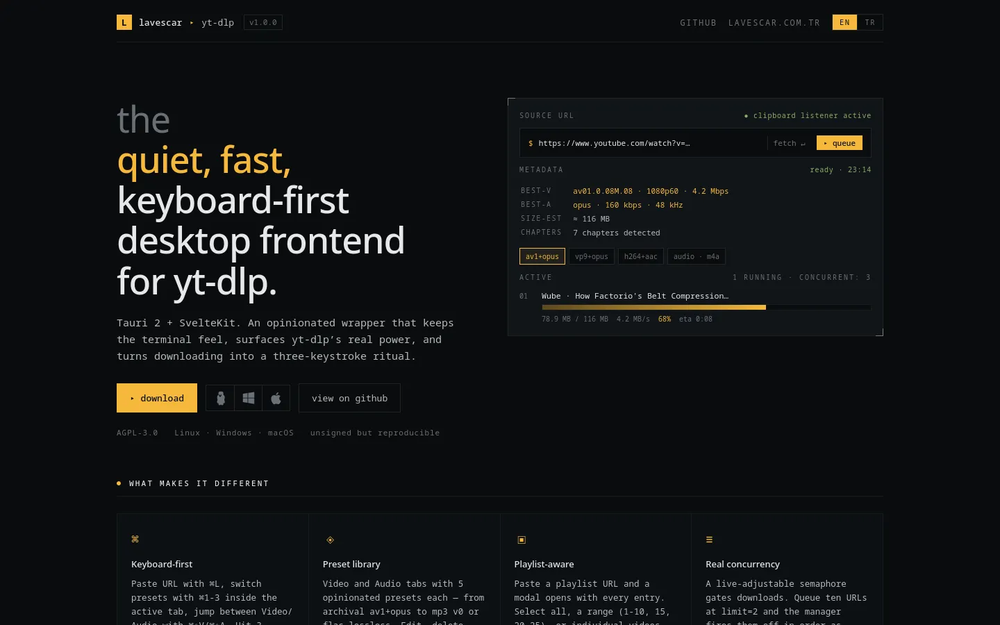
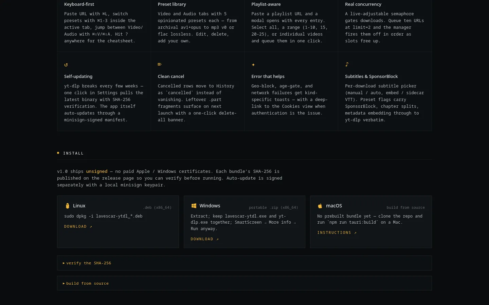
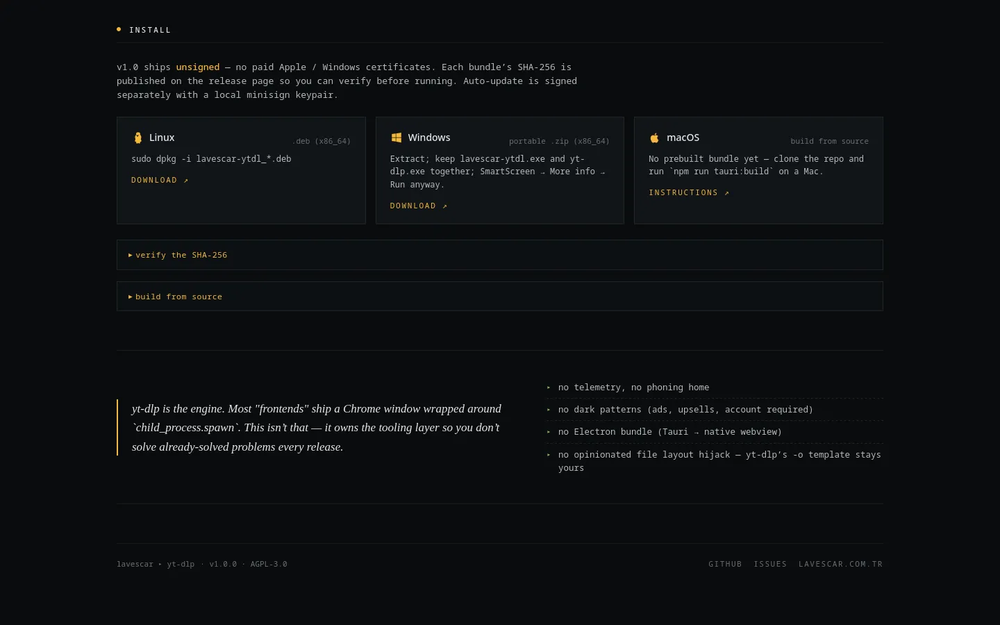

<div align="center">


# lavescar ▸ yt-dlp

**An opinionated, keyboard-first desktop frontend for yt-dlp.** Tauri 2 + SvelteKit (SPA) + Svelte 5 runes, with preset-driven workflows, live progress streaming, and a queue/history backed by SQLite.

[](#architecture)
[](https://github.com/Lavescar-dev/lavescar-ytdl/releases)
[](https://yt.lavescar.com.tr)
[](LICENSE)

[**▸ Landing page**](https://yt.lavescar.com.tr) · [**▸ Releases**](https://github.com/Lavescar-dev/lavescar-ytdl/releases) · [**▸ Portfolio**](https://lavescar.com.tr)

</div>

---

<p align="center"></p>

## Why this exists

Most yt-dlp GUIs reproduce the CLI in a window. This one is built around the workflows real archivers actually use: paste, hit a preset hotkey, walk away. The whole queue is keyboard-navigable; mouse use is optional.

## Features

- **Keyboard-first** — `⌘L` focus URL, `⌘1/2/3` hotkey presets, `⌘,` settings, `?` cheatsheet
- **Preset system** — yt-dlp `-f` spec + extra flags (SponsorBlock, chapter split, embed metadata), per-preset hotkey
- **Queue + history** — SQLite-backed, re-download guard, date-grouped history with search
- **Progress stream** — real-time bytes/speed/ETA via Tauri events (no polling)
- **Cookie support** — `--cookies-from-browser firefox|chromium|brave` direct from settings
- **Throttle** — per-download `--limit-rate` MB/s slider
- **Open in mpv** — or OS default player; "show in folder" reveal
- **Dependency detection** — ffmpeg/aria2c version inspection in settings
- **Concurrent-limit semaphore** — true gating, live-adjustable
- **Auto-updater** — local minisign signing for delta updates

## Tech stack

| Layer | Technology |
|---|---|
| Frontend | SvelteKit (SPA) + Svelte 5 runes (`.svelte.ts` singletons) |
| Shell | Tauri 2 (`tauri-plugin-shell`, `tauri-plugin-dialog`) |
| DB | rusqlite (bundled SQLite, migrations in `src-tauri/migrations/`) |
| Sidecar | yt-dlp (target-triple suffixed binary) |
| Build | Cargo + Vite |
| API boundary | `src/lib/api/tauri.ts` auto-detects Tauri vs browser |

## Screenshots

<table>
  <tr>
    <td></td>
    <td></td>
  </tr>
  <tr>
    <td colspan="2"></td>
  </tr>
</table>

## Install

Prebuilt bundles on [Releases](https://github.com/Lavescar-dev/lavescar-ytdl/releases) — v1.0.0 ships Linux AppImage/deb, Windows MSI/NSIS, macOS dmg.

> **Bundles are not code-signed** (no paid Apple / Windows certs). The app is signed for auto-updates only — OS install prompts will show an "unknown developer" warning on first launch. Steps below.

### Linux

```bash
chmod +x lavescar-ytdl_*.AppImage
./lavescar-ytdl_*.AppImage

# or as a deb
sudo dpkg -i lavescar-ytdl_*.deb
```

### macOS

On first launch Gatekeeper will refuse. Either:

1. **Right-click → Open → Open anyway** (per-app bypass)
2. **Strip the quarantine attribute** (permanent):
   ```bash
   xattr -rd com.apple.quarantine /Applications/lavescar-ytdl.app
   ```

### Windows

SmartScreen will say "Windows protected your PC". Click **More info** → **Run anyway**.

### Verifying downloads

Each release ships SHA-256 hashes:

```bash
sha256sum lavescar-ytdl_*.AppImage          # Linux
shasum -a 256 lavescar-ytdl_*.dmg           # macOS
certutil -hashfile lavescar-ytdl_*.msi SHA256   # Windows
```

Match against `SHASUMS.txt` on the release page.

## Build from source

Prereqs: Rust 1.77.2+, Node 20+, [Tauri prereqs](https://tauri.app/start/prerequisites/).

```bash
# fetch yt-dlp sidecar for your platform
cd src-tauri/binaries
curl -L -o yt-dlp-x86_64-unknown-linux-gnu \
  https://github.com/yt-dlp/yt-dlp/releases/latest/download/yt-dlp_linux
chmod +x yt-dlp-x86_64-unknown-linux-gnu
cd ../..

# install frontend + run
npm install
npm run tauri:dev          # dev window with hot reload
npm run tauri:build        # production bundle
```

### Cross-platform sidecar names

yt-dlp binaries must live in `src-tauri/binaries/` with Tauri's target-triple suffix:

| Platform | Filename |
|---|---|
| Linux x86_64 | `yt-dlp-x86_64-unknown-linux-gnu` |
| Windows x86_64 | `yt-dlp-x86_64-pc-windows-msvc.exe` |
| macOS Apple Silicon | `yt-dlp-aarch64-apple-darwin` |
| macOS Intel | `yt-dlp-x86_64-apple-darwin` |

CI fetches them automatically — see `.github/workflows/release.yml`.

## Keyboard shortcuts

| Key | Action |
|---|---|
| `⌘L` | Focus URL input |
| `⌘1-3` | Select hotkey-bound preset |
| `⌘,` | Open settings |
| `?` | Show shortcuts overlay |
| `ESC` | Close overlay |
| `↵` | Fetch metadata (URL input) |

## Architecture

- **Frontend** — SvelteKit (SPA mode, `adapter-static` + `fallback: 'index.html'`). Svelte 5 rune-based stores (`.svelte.ts` singletons)
- **Backend** — Tauri 2, `tauri-plugin-shell` for yt-dlp sidecar, `tauri-plugin-dialog` for folder picker
- **Persistence** — `rusqlite` bundled SQLite, migrations under `src-tauri/migrations/`
- **Single boundary** — `src/lib/api/tauri.ts` auto-detects Tauri vs browser; mock data keeps dev server standalone

## Roadmap

**Shipped in v1.0:** concurrent-limit semaphore, yt-dlp self-update, playlist modal (all/range/manual), subtitle per-download picker, clipboard URL auto-detect (opt-in), categorised error toasts, auto-updater with minisign signing, cancel→`.part` cleanup, startup orphan sweep.

**Deferred to v1.1+:** Twitch VOD / Soundcloud / Bandcamp preset categories, batch URL file import (`.txt` → enqueue), post-process hooks, Firefox/Chromium direct cookie import (DPAPI/Keychain/libsecret), `latest.json` manifest automation, axe-core a11y lint, paid code signing, remote control HTTP API, CLI mode.

## Legal

Licensed under **AGPL-3.0** (see `LICENSE`). Bundled yt-dlp is Unlicense/public domain. ffmpeg (when bundled) is LGPL/GPL.

> **Use responsibly.** YouTube Terms of Service prohibit downloads without permission; this tool is intended for content you have rights to, public domain material, or personal archival where legally permitted. You are responsible for your use.

---

<sub>Built by **[Lavescar](https://lavescar.com.tr)** · [Portfolio](https://lavescar.com.tr/#projects) · [efe@lavescar.com.tr](mailto:efe@lavescar.com.tr)</sub>
